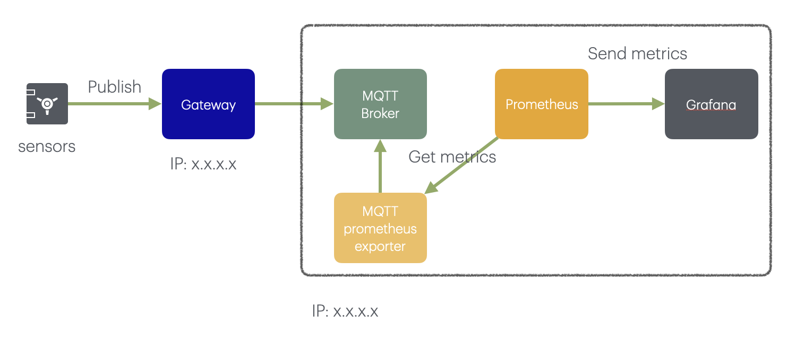

## 🧭 **Architecture Overview: MQTT Monitoring with Prometheus & Grafana**

This architecture shows the data flow and monitoring setup of an IoT system using MQTT, Prometheus, and Grafana. It consists of **two main parts**: data publishing from sensors and system monitoring through metrics.

---


## 🧱 **Component Descriptions**

### 1. **Sensors**

* These are IoT devices that measure things like temperature, humidity, or pressure.
* They **publish data via MQTT** to the next component: the **Gateway**.

---

### 2. **Gateway**

* Acts as the first MQTT endpoint that sensors send data to.
* It is typically an edge device or local broker that may preprocess, log, or forward MQTT messages.
* Identified by its **IP address** (`x.x.x.x`).
* It forwards messages to the central **MQTT Broker**.

---

### 3. **MQTT Broker**

* This is the core message broker (e.g., **VerneMQ** or **Mosquitto**) that receives all MQTT messages.
* It handles clients, topics, message routing, and more.
* Metrics such as number of connected clients, messages per second, etc., are exposed via a monitoring interface.

---

### 4. **MQTT Prometheus Exporter**

* This component collects internal metrics from the **MQTT Broker** (such as traffic volume, client count, topic activity).
* It **converts those metrics into Prometheus format** (exposed at `/metrics` endpoint).
* Prometheus scrapes this exporter to collect the data.

---

### 5. **Prometheus**

* A time-series database that periodically **pulls (scrapes)** metrics from the exporter.
* It stores those metrics for historical analysis.

---

### 6. **Grafana**

* A dashboard tool that queries Prometheus.
* It visualizes the collected data in the form of **graphs, gauges, and alerts**.
* This allows operators and developers to monitor MQTT system health and traffic in real-time.

---

## 🔄 **Data & Metrics Flow**

1. **Sensor Data Flow:**

   ```
   Sensors → Gateway → MQTT Broker
   ```

2. **Monitoring Metrics Flow:**

   ```
   MQTT Broker → MQTT Exporter → Prometheus → Grafana
   ```

---

## ✅ **System details**

| Component      | Value                                                            |
| -------------- | ---------------------------------------------------------------- |
| Gateway IP     | \_\_\_\_\_\_\_\_\_\_\_\_\_\_\_\_\_\_\_\_\_\_\_\_\_\_\_\_\_\_\_\_ |
| MQTT Broker IP | \_\_\_\_\_\_\_\_\_\_\_\_\_\_\_\_\_\_\_\_\_\_\_\_\_\_\_\_\_\_\_\_ |
| VerneMQ URL    | \_\_\_\_\_\_\_\_\_\_\_\_\_\_\_\_\_\_\_\_\_\_\_\_\_\_\_\_\_\_\_\_ |
| Prometheus URL | \_\_\_\_\_\_\_\_\_\_\_\_\_\_\_\_\_\_\_\_\_\_\_\_\_\_\_\_\_\_\_\_ |
| Grafana URL    | \_\_\_\_\_\_\_\_\_\_\_\_\_\_\_\_\_\_\_\_\_\_\_\_\_\_\_\_\_\_\_\_ |

