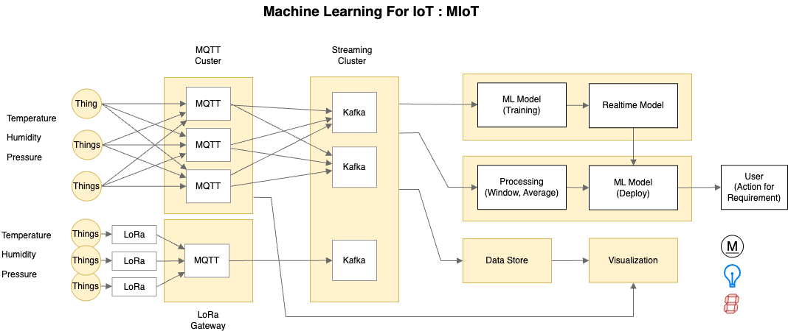

# 🧠 Machine Learning for IoT (MLoT) - Architecture Overview

This document describes an end-to-end architecture for applying **machine learning to real-time IoT sensor data**. The system integrates data collection from distributed devices via **MQTT** and **LoRa**, streams it using **Apache Kafka**, processes it for analytics and modeling, and outputs actionable insights to users and actuators.



---

## 📡 1. IoT Devices (Things)

The system begins with IoT-enabled devices — referred to as **"Things"** — deployed in the environment to collect sensor readings such as:

- 🌡️ **Temperature**
- 💧 **Humidity**
- ⚖️ **Pressure**

These devices can communicate data using two main technologies:

- **Direct MQTT**: Devices connect to a nearby MQTT broker and send data in lightweight publish/subscribe format.
- **LoRa Gateway**: For low-power, long-range communication, devices transmit via LoRa to a gateway, which then forwards data to an MQTT broker.

---

## 📥 2. Data Ingestion

### 🔶 MQTT Cluster

- A **cluster of MQTT brokers** receives data directly from devices or indirectly via LoRa gateways.
- MQTT enables lightweight messaging using topics (e.g., `iot-frames-model`, `iot-frames-sensor`).
- MQTT messages are forwarded to a **Kafka streaming system** for scalable processing.

### 🔶 LoRa Gateway

- LoRa devices send data to **LoRa gateways**, which aggregate and decode signals.
- The gateways act as MQTT clients, pushing messages to the cluster for further routing into Kafka.

This structure allows flexible deployment in various environments, including rural or industrial areas.

---

## 🔄 3. Streaming Cluster

### ⚙️ Apache Kafka

Kafka serves as the backbone for the streaming data pipeline:

- It ingests messages from MQTT.
- Organizes them into **topics** (e.g., `stream-frame`.
- Enables real-time consumption by **multiple downstream consumers**, including:
  - Machine learning models
  - Processing modules
  - Visualization tools

Kafka’s distributed nature ensures fault tolerance, scalability, and durability.

---

## 🤖 4. Machine Learning System

This component handles the core intelligence of the system.

### 🏗️ ML Model (Training)

- Historical sensor data from Kafka is used to **train predictive models** (e.g., regression, classification).
- This may be done in **batch mode** or **incremental (online) mode** using frameworks like:
  - `scikit-learn`, `River`, `TensorFlow`, `PyTorch`

### ⚡ Realtime Model

- Trained models are deployed to **make real-time predictions** as data streams in.
- Examples of predictions:
  - Predicting fan speed from temperature/humidity
  - Detecting abnormal pressure patterns

### 🧮 Processing

- Performs **windowing** (e.g., average values every 1 min) and **feature engineering**.
- This smooths out noise and prepares the data for ML inference.
- Real-time stream processors like Kafka Streams or Flink can be used here.

### 🚀 ML Model (Deploy)

- Trained and validated models are deployed into production for live inference.
- Predictions are output to Kafka or stored in databases for further use.

---

## 💾 5. Output & Visualization

### 🗃️ Data Store

- Stores processed sensor data and ML predictions.
- Common backends: PostgreSQL, InfluxDB, MongoDB, or time-series databases.

### 📊 Visualization

- Dashboards are built to monitor sensor trends, prediction outcomes, and system health.
- Tools like **Grafana**, **Kibana**, or custom web apps are used.

---

## 👤 6. User Interaction

End users — engineers, system operators, or administrators — can:

- Monitor real-time visualizations.
- Be alerted of anomalies or threshold breaches.
- Take action based on insights, such as:
  - 💡 Turning on/off lights
  - 🔧 Activating motors or valves
  - 🧠 Triggering further processing workflows

The goal is to **automate decisions** or **assist human operators** in responding promptly.

---

## 🔁 🔄 Data Flow Summary


1. IoT Devices → MQTT or LoRa → MQTT Broker
2. MQTT → Kafka (Streaming Ingestion)
3. Kafka → Processing → ML Model (Training & Inference)
4. ML Predictions → Data Store → Visualization
5. User sees output → Takes action (manual or automatic)


## Managing contailers

### 1. Remove all containers

```docker
# list all containers
docker container ls -a

# remove all containers
docker container prune
```
### 1. Remove all images

```docker
# list all images
docker image ls -a

# remove all images
docker image prune -a 
```

### 1. Remove all volumes

```docker
# list all volumes
docker volume ls -a

# remove all volumes
docker volume prune -a 
```

### 1. Remove all networks

```docker
# list all networks
docker network ls -a

# remove all networks
docker network prune
```


## Containers
1. Server [https://github.com/hanattaw/Iot-class-2025-server](https://github.com/hanattaw/Iot-class-2025-server)
1. Gateway [https://github.com/hanattaw/Iot-class-2025-gateway](https://github.com/hanattaw/Iot-class-2025-gateway)
1. Publisher [https://github.com/hanattaw/Iot-class-2025-publisher](https://github.com/hanattaw/Iot-class-2025-publisher)
1. Subscriber [https://github.com/hanattaw/Iot-class-2025-subscriber](https://github.com/hanattaw/Iot-class-2025-subscriber)
1. MQTT-Bridge-Kafka [https://github.com/hanattaw/Iot-class-2025-mqtt-bridge-kafka](https://github.com/hanattaw/Iot-class-2025-mqtt-bridge-kafka)
1. Data to Influxdb [https://github.com/hanattaw/Iot-class-2025-data-to-influxdb](https://github.com/hanattaw/Iot-class-2025-data-to-influxdb)
1. Kafa-to-JSONL [https://github.com/hanattaw/Iot-class-2025-kafka-to-jsonl](https://github.com/hanattaw/Iot-class-2025-kafka-to-jsonl)
1. Train Data [https://github.com/hanattaw/Iot-class-2025-train-from-data](https://github.com/hanattaw/Iot-class-2025-train-from-data)
1. Predict-then-Infulxdb [https://github.com/hanattaw/Iot-class-2025-predict-then-influxdb](https://github.com/hanattaw/Iot-class-2025-predict-then-influxdb)
1. Online ML [https://github.com/hanattaw/Iot-class-2025-online-ml-predict](https://github.com/hanattaw/Iot-class-2025-online-ml-predict)
1. Device [https://github.com/hanattaw/Iot-class-2025-device](https://github.com/hanattaw/Iot-class-2025-device)


```bash
# Remove all containers
docker container prune

# Remove all volumes
docker volume prune -a 

# Remove all networks
docker network prune

# Remove all folders
cd 
sudo rm -rf Iot-class-2025-server
sudo rm -rf Iot-class-2025-publisher
sudo rm -rf Iot-class-2025-subscriber
sudo rm -rf Iot-class-2025-mqtt-bridge-kafka
sudo rm -rf Iot-class-2025-data-to-influxdb
sudo rm -rf Iot-class-2025-kafka-to-jsonl
sudo rm -rf Iot-class-2025-train-from-data
sudo rm -rf Iot-class-2025-predict-then-influxdb
sudo rm -rf Iot-class-2025-online-ml-predict


cd 
git clone https://github.com/hanattaw/Iot-class-2025-server
git clone https://github.com/hanattaw/Iot-class-2025-publisher
git clone https://github.com/hanattaw/Iot-class-2025-subscriber
git clone https://github.com/hanattaw/Iot-class-2025-mqtt-bridge-kafka
git clone https://github.com/hanattaw/Iot-class-2025-data-to-influxdb
git clone https://github.com/hanattaw/Iot-class-2025-kafka-to-jsonl
git clone https://github.com/hanattaw/Iot-class-2025-train-from-data
git clone https://github.com/hanattaw/Iot-class-2025-predict-then-influxdb
git clone https://github.com/hanattaw/Iot-class-2025-online-ml-predict

```

## Getting Server Containers 
```bash
cd 
git clone https://github.com/hanattaw/Iot-class-2025-server
git clone https://github.com/hanattaw/Iot-class-2025-publisher
git clone https://github.com/hanattaw/Iot-class-2025-subscriber
git clone https://github.com/hanattaw/Iot-class-2025-mqtt-bridge-kafka
git clone https://github.com/hanattaw/Iot-class-2025-data-to-influxdb
git clone https://github.com/hanattaw/Iot-class-2025-kafka-to-jsonl
git clone https://github.com/hanattaw/Iot-class-2025-train-from-data
git clone https://github.com/hanattaw/Iot-class-2025-predict-then-influxdb
git clone https://github.com/hanattaw/Iot-class-2025-online-ml-predict

```

## Getting Gateway Container
```bash
cd 
git clone https://github.com/hanattaw/Iot-class-2025-gateway

```
