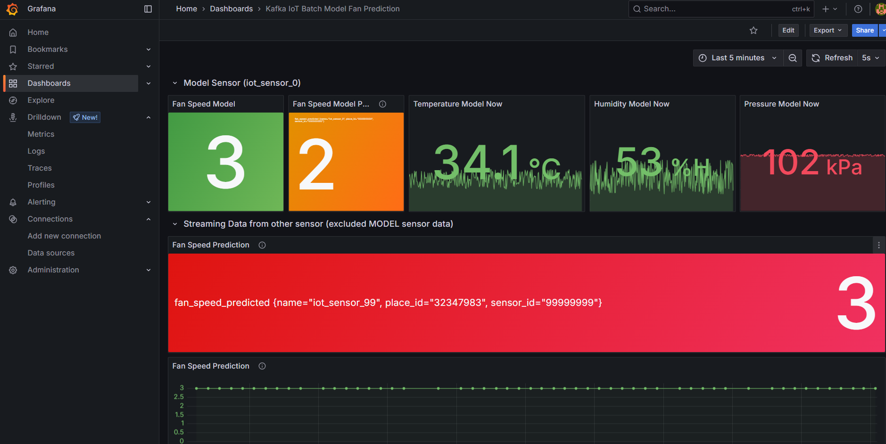

# Online Prediction

<!-- Online Prection ทำงานอย่างไร  -->

## ปิดการใช้งานของ Batch ML ดังนี้

1. Kafka-to-Jsonl
2. Train-from-data
3. Predict-then-influxdb

## เริ่มใช้งาน Online ML ดังนี้

1. Iot-class-2025-server
2. Iot-class-2025-publisher
3. Iot-class-2025-mqtt-bridge-kafka
4. Iot-class-2025-data-to-influxdb
5. Iot-class-2025-flask-publisher
6. Iot-class-2025-online-ml-predict

## ผลที่ได้จากการใช้ ML มีดังนี้

<!-- แนบรูป Grafana  พร้อมอธิบาย -->

Fan Speed Model ค่าปัจจุบันที่ Model คาดการณ์ว่าความเร็วพัดลมควรอยู่ที่ระดับ 3

Fan Speed Model Prediction อีกโมเดลหนึ่งทำนายว่าความเร็วพัดลมควรอยู่ที่ 2 ตรงนี้แสดงว่าอาจมีโมเดลหลายชุดที่ใช้คาดการณ์ความเร็วพัดลม

Temperature Model Now อุณหภูมิปัจจุบัน 34.1 °C

Humidity Model Now ความชื้นสัมพัทธ์ปัจจุบัน 53 %RH

Pressure Model Now ความดันอากาศปัจจุบัน 102 kPa

สรุป ระบบนี้ใช้เซ็นเซอร์วัดอุณหภูมิ ความชื้น และความดันส่งค่าเข้าสู่ Model เพื่อพยากรณ์ความเร็วพัดลมที่เหมาะสม

ตอนนี้ Model หลักทำนายว่า Fan Speed = 3 (อีกโมเดลหนึ่งให้ค่า 2)

การพยากรณ์จาก sensor ภายนอก (iot_sensor_99) ก็ได้ค่า 3 เช่นกัน

ค่าพยากรณ์คงที่ ทำให้พัดลมอาจกำลังหมุนที่ระดับ 3 อย่างต่อเนื่อง